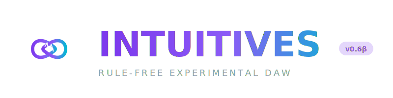

# INTUITIVES DAW v0.6 BETA

<p align="center">
  
</p>

<p align="center">
  <strong>Rule-free, Experimental Digital Audio Workstation</strong>
</p>

<p align="center">
  <em>"Does this sound cool?" - The only rule.</em>
</p>

<p align="center">
  
  
  
</p>

---

## 🎹 What is Intuitives?

Intuitives is a revolutionary DAW that breaks free from traditional music production constraints. Instead of enforcing scales, quantization, and music theory rules, Intuitives embraces:

- **🎲 AI-Powered Generation** - Markov chains, genetic algorithms, cellular automata
- **📝 Multimedia as Input** - Text, images, colors become music
- **🎨 Chromasynesthesia** - Every note has a color
- **🚫 No Guardrails** - If it sounds cool, it's right

---

## ✨ v0.6 Beta Features

### 🔊 Native Audio Engine (40 Original Features)

| Category          | Features                                                      |
| :---------------- | :------------------------------------------------------------ |
| **Oscillators**   | Quantum, Chaos, Wavetable, FM, Additive, Noise, Fractal + 2   |
| **Effects**       | SVF, Moog, Formant, Delay, Reverb, Distortion, Compressor + 4 |
| **Generators**    | Markov, Genetic, Cellular, L-System                           |
| **Input**         | Text-to-Melody, Color-to-Harmony, Image-to-Pattern            |
| **Visualization** | Waveform, Spectrum, Chromasynesthesia, Level Meters           |

### 🤖 AI Tools (Python Layer)

| Tool               | What It Does                                        |
| :----------------- | :-------------------------------------------------- |
| **AudioAnalyzer**  | BPM, pitch, onset, key detection, spectral features |
| **AIGenerator**    | Markov/Genetic/Cellular melody generation           |
| **PatternBuilder** | Pattern strings, Euclidean rhythms, chord parsing   |
| **MelodyRNN**      | Neural network melody generation (optional)         |
| **StemSeparator**  | Vocals/drums/bass/other separation (optional)       |
| **TextToMusic**    | AudioCraft text-to-audio generation (optional)      |
| **AudioToMIDI**    | Polyphonic transcription (optional)                 |

### 🖥️ Native macOS App

- **Architecture:** x86_64 (Intel)
- **Minimum macOS:** 10.15 (Catalina)
- **App Bundle:** `IntuitivesDAW.app`

---

## 🚀 Quick Start

### Run Native App

```bash
# Open the app bundle
open build/IntuitivesDAW.app

# Or run directly
./build/IntuitivesDAW.app/Contents/MacOS/IntuitivesDAW
```

### Run Python AI Tools

```bash
cd native/intuitives_daw

# Install dependencies
pip install -r requirements.txt

# Run demo
python demo.py

# Run full Python GUI
python intuitives.py
```

### Build from Source

```bash
cd native/intuitives_daw

# Quick build
./build.sh

# Build with options
./build.sh --debug --stargate --gui
```

---

## 🎮 Keyboard Controls

|     Key     | Action                   |
| :---------: | :----------------------- |
|   `Space`   | Play/Pause               |
|     `S`     | Stop                     |
|     `T`     | Add Track                |
|     `M`     | Generate Markov Melody   |
|     `G`     | Generate Genetic Melody  |
|     `C`     | Generate Cellular Rhythm |
|     `X`     | Generate from Text       |
| `Q` / `ESC` | Quit                     |

---

## 🎨 Chromasynesthesia Colors

Every MIDI note has its own color:

| Note | Color      | Hex     |
| :--: | :--------- | :------ |
|  C   | 🔴 Red     | #ff5c5c |
|  D   | 🟠 Orange  | #ffb84c |
|  E   | 🟡 Yellow  | #e8ff4c |
|  F   | 🟢 Green   | #8cff4c |
|  G   | 🔵 Cyan    | #4cffff |
|  A   | 🔷 Blue    | #4c4cff |
|  B   | 🟣 Magenta | #ff4cff |

---

## 📁 Project Structure

```
native/intuitives_daw/
├── IntuitivesDAW.app          # macOS App Bundle (after build)
├── assets/
│   ├── AppIcon.svg            # App icon (1024x1024)
│   ├── icon.svg               # Symbol icon
│   └── logo.svg               # Full logo with text
├── src/
│   └── main.cpp               # Native C++ application
├── include/
│   └── intuitives_daw.h       # DAW header
├── sglib/
│   ├── brand.py               # Branding constants
│   ├── integrations.py        # Audio analysis & generation
│   └── ai_models.py           # Neural network models
├── sgui/
│   └── widgets/generators.py  # Generator UI panel
├── files/themes/
│   └── intuitives/            # Custom theme
├── docs/
│   └── TOOLS.md               # Integrated tools reference
├── demo.py                    # Feature demo script
├── intuitives.py              # Python entry point
├── requirements.txt           # Python dependencies
└── build.sh                   # Build script
```

---

## 📊 System Requirements

| Requirement      | Minimum                 |
| :--------------- | :---------------------- |
| **OS**           | macOS 10.15 (Catalina)  |
| **Architecture** | x86_64 (Intel)          |
| **RAM**          | 4 GB                    |
| **Disk**         | 50 MB                   |
| **Audio**        | Any audio output device |

### Optional (for AI features)

| Package       | For                      |
| :------------ | :----------------------- |
| `librosa`     | Advanced audio analysis  |
| `magenta`     | Neural melody generation |
| `spleeter`    | Stem separation          |
| `audiocraft`  | Text-to-music            |
| `basic-pitch` | Audio-to-MIDI            |

---

## 🔧 Building

### Prerequisites

```bash
# macOS build tools
xcode-select --install

# CMake
brew install cmake
```

### Build Commands

```bash
cd native/intuitives_daw

# Create build directory
mkdir build && cd build

# Configure (Intel architecture)
cmake .. -DCMAKE_BUILD_TYPE=Release

# Build
make -j8

# Run
./IntuitivesDAW.app/Contents/MacOS/IntuitivesDAW
```

---

## 📜 License

- **Native Engine:** MIT License
- **Stargate Components:** GPLv3
- **AI Model Wrappers:** MIT License

---

## 🙏 Credits

- **Intuitives DSP Engine:** 40 original audio features
- **Stargate DAW:** Professional engine foundation
- **Magenta:** Google's music AI
- **AudioCraft:** Meta's text-to-music
- **Spleeter:** Deezer's stem separation

---

## 🎵 Philosophy

> "Does this sound cool?"
>
> That's the only question that matters.
>
> No piano roll constraints.
> No scale enforcement.
> No rules.
>
> Just create.

---

<p align="center">
  <strong>INTUITIVES DAW v0.6 BETA</strong><br>
  <em>Made for experimental musicians everywhere.</em>
</p>
